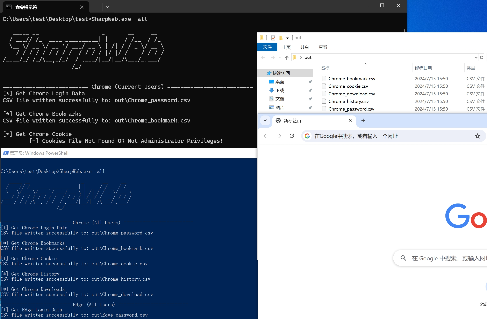

# SharpWeb

`SharpWeb` 是一个浏览器数据（密码|历史记录|Cookie|书签|下载记录）的导出工具，支持主流浏览器。


> 免责声明：此工具仅限于安全研究，用户承担因使用此工具而导致的所有法律和相关责任！作者不承担任何法律责任！

<p align="center">
    <a href="https://github.com/StarfireLab/SharpWeb"></a>
    <a href="https://github.com/StarfireLab/SharpWeb"></a>
    <a href="https://github.com/StarfireLab/SharpWeb"></a>
  <a href="https://github.com/StarfireLab/SharpWeb"></a>
     <a href="https://github.com/lele8"></a>

## 浏览器支持情况

| 浏览器                | 密码  | Cookie | 书签  | 历史记录 |
|:-------------------|:---:|:------:|:---:|:----:|
| Google Chrome      |  ✅  |   ✅    |  ✅  |  ✅   |
| Google Chrome Beta |  ✅  |   ✅    |  ✅  |  ✅   |
| Chromium           |  ✅  |   ✅    |  ✅  |  ✅   |
| Microsoft Edge     |  ✅  |   ✅    |  ✅  |  ✅   |
| 360 极速浏览器          |  ✅  |   ✅    |  ✅  |  ✅   |
| QQ                 |  ✅  |   ✅    |  ✅  |  ✅   |
| Brave              |  ✅  |   ✅    |  ✅  |  ✅   |
| Opera              |  ✅  |   ✅    |  ✅  |  ✅   |
| OperaGX            |  ✅  |   ✅    |  ✅  |  ✅   |
| Vivaldi            |  ✅  |   ✅    |  ✅  |  ✅   |
| Yandex             |  ✅  |   ✅    |  ✅  |  ✅   |
| CocCoc             |  ✅  |   ✅    |  ✅  |  ✅   |
| Firefox            |  ✅  |   ✅    |  ✅  |  ✅   |
| Firefox Beta       |  ✅  |   ✅    |  ✅  |  ✅   |
| Firefox Dev        |  ✅  |   ✅    |  ✅  |  ✅   |
| Firefox ESR        |  ✅  |   ✅    |  ✅  |  ✅   |
| Firefox Nightly    |  ✅  |   ✅    |  ✅  |  ✅   |
| 搜狗 浏览器 | ✅ | ✅ | ✅ | ✅ |
| IE 浏览器             |  ✅  |   ❌   |  ✅  |  ✅   |
| 360 浏览器             |  ❌  |   ❌    |  ❌  |  ❌   |

## 使用方式

```

   _____ __                   _       __     __
  / ___// /_  ____ __________| |     / /__  / /_
  \__ \/ __ \/ __ `/ ___/ __ \ | /| / / _ \/ __ \
 ___/ / / / / /_/ / /  / /_/ / |/ |/ /  __/ /_/ /
/____/_/ /_/\__,_/_/  / .___/|__/|__/\___/_.___/
                     /_/


Export all browingdata(password/cookie/history/download/bookmark) from browser
By @lele8

  -all           Obtain all browser data
  -b             Available browsers: chromium/firefox/ie
  -p             Custom profile dir path or the path of Cookies
  -s             Specify the path of Local State
  -show          Output the results on the command line
  -zip           Compress result to zip (default: false)
  -format        Export to CSV (default) or JSON format

  Usage:
       SharpWeb.exe -all
       SharpWeb.exe -all -zip
       SharpWeb.exe -all -show
       SharpWeb.exe -all -format json
       SharpWeb.exe -b firefox
       SharpWeb.exe -b chromium -p "C:\Users\test\AppData\Local\Google\Chrome\User Data\Default"
       SharpWeb.exe -b chromium -p "C:\Users\test\AppData\Local\Google\Chrome\User Data\Default\Network\Cookies" -s "C:\Users\test\AppData\Local\Google\Chrome\User Data\Local State"
```

## 新增功能

1.支持cookie导出json格式，可一键导入EditThisCookie插件；

2.指定基于Chromium内核的浏览器导出Cookie；

3.当Chrome或Edge等浏览器运行时复制不了Cookies，使用管理员权限进行卷影复制；



## 免责声明

本工具仅面向**合法授权**的企业安全建设行为，如您需要测试本工具的可用性，请自行搭建靶机环境。

在使用本工具进行检测时，您应确保该行为符合当地的法律法规，并且已经取得了足够的授权。**请勿对非授权目标进行扫描和攻击。**

**如您在使用本工具的过程中存在任何非法行为，您需自行承担相应后果，作者将不承担任何法律及连带责任。**

在安装并使用本工具前，请您**务必审慎阅读、充分理解各条款内容**，限制、免责条款或者其他涉及您重大权益的条款可能会以加粗、加下划线等形式提示您重点注意。 除非您已充分阅读、完全理解并接受本协议所有条款，否则，请您不要安装并使用本工具。您的使用行为或者您以其他任何明示或者默示方式表示接受本协议的，即视为您已阅读并同意本协议的约束。

# 安恒-星火实验室

<h1 align="center">
  
  <br>
</h1>

专注于实战攻防与研究，研究涉及实战攻防、威胁情报、攻击模拟与威胁分析等，团队成员均来自行业具备多年实战攻防经验的红队、蓝队和紫队专家。本着以攻促防的核心理念，通过落地 ATT&CK 攻防全景知识库，全面构建实战化、常态化、体系化的企业安全建设与运营。
